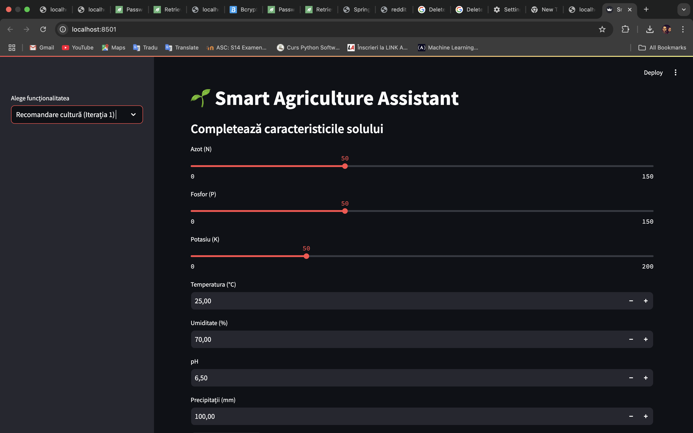
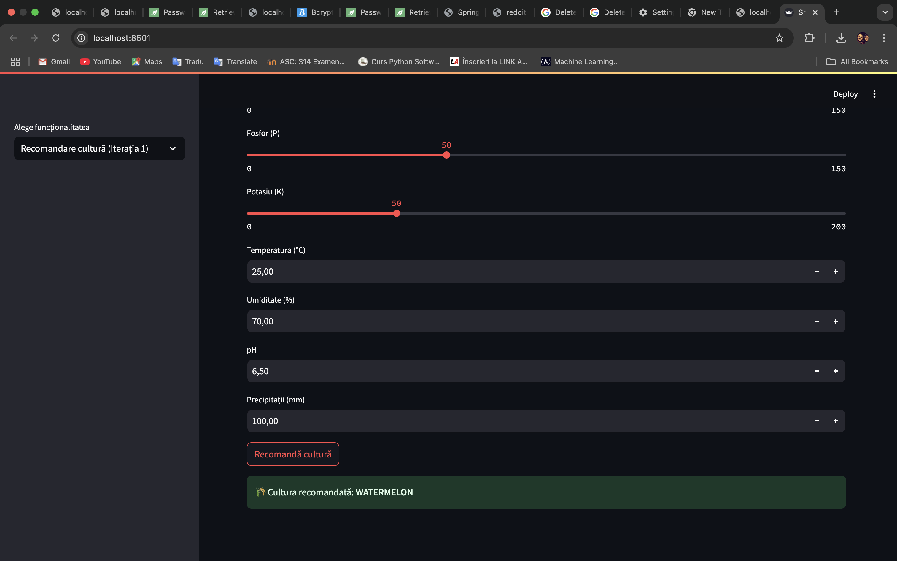
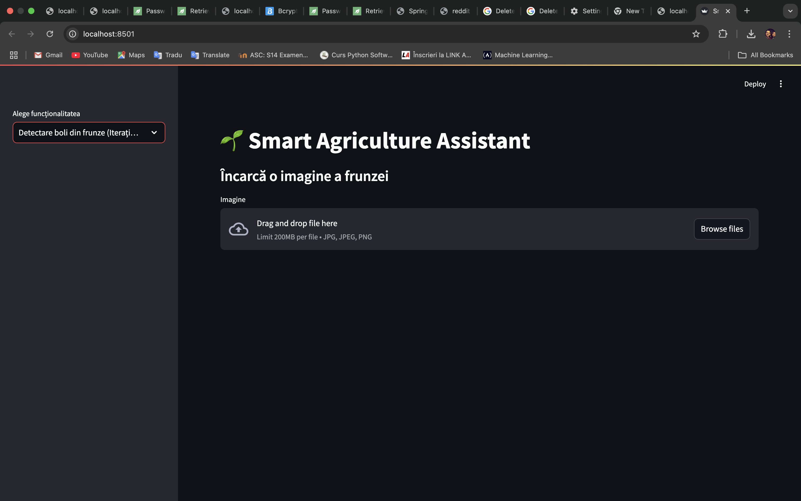
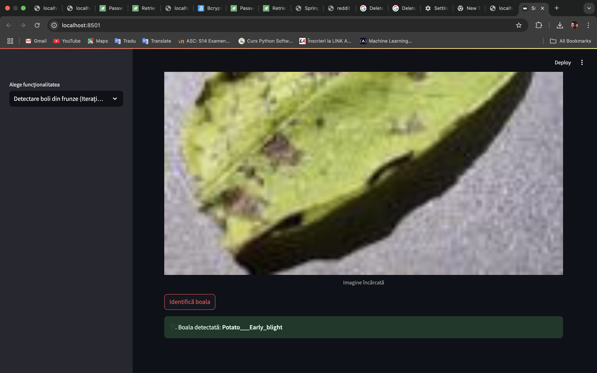

# 🌱 Smart Agriculture - Proiect de Licență

Acest proiect are ca scop dezvoltarea unei aplicații inteligente pentru agricultură, care integrează modele AI pentru a analiza datele din teren și a oferi recomandări utile fermierilor.

---

## 📁 Structura proiectului

```
📦 licenta-smart-agriculture
 ┣ 📂 app
 ┃ ┣ 📂 Utils              # Funcții și clase de utilitate
 ┃ ┣ 📂 datasets           # Seturi de date folosite în antrenare/testare
 ┃ ┣ 📂 models             # Modele AI antrenate sau definite
 ┃ ┣ 📜 app.py             # Scriptul principal al aplicației
 ┃ ┣ 📜 requirements.txt   # Pachete necesare pentru rulare
 ┃ ┗ 📜 README.md          # Acest fișier de documentație
 ┣ 📂 documentatie
 ┃ ┣ 📜 lucrare.tex        # Fișierul TeX pentru redactarea lucrării de licență
 ┃ ┗ 📜 .gitkeep           # Placeholder pentru folderul de documentație
```

---

## ⚙️ Tehnologii folosite

- Python 3.x
- Jupyter Notebooks (urmează să fie adăugate)
- Biblioteci AI/ML: `scikit-learn`, `pandas`, `numpy`, `matplotlib`, `torch` etc.
- Git + GitHub pentru versionare
- LaTeX pentru redactarea documentației

---

## ▶️ Cum rulezi aplicația

1. Clonează repo-ul:
   ```bash
   git clone https://github.com/ChiperRoberto/licenta-smart-agriculture.git
   cd licenta-smart-agriculture/app
   ```

2. Creează un mediu virtual și activează-l:
   ```bash
   python -m venv .venv
   source .venv/bin/activate     # pe Mac/Linux
   .venv\Scripts\activate        # pe Windows
   ```

3. Instalează dependențele:
   ```bash
   pip install -r requirements.txt
   ```

4. Rulează aplicația:
   ```bash
    streamlit run app.py
   ```

---

## 📌 Status

- ✅ Structură inițială completă
- ✅ Codul aplicației adăugat
- ⏳ Jupyter Notebook-uri (urmează să fie integrate)
- ⏳ Documentație LaTeX (urmează completarea)

---

## 👤 Autor

- **Nume:** Roberto Chiper  
- **Coordonator:** Prof. Laura Diosan

---

## 🧠 Descriere generală

Proiectul „Smart Agriculture” își propune să integreze metode de inteligență artificială pentru a sprijini deciziile din agricultură. Aplicația va putea:
- Recomanda culturi în funcție de parametrii solului și climă
- Detecta boli din imagini de frunze
- Estima randamentul pe baza datelor de intrare

---

## 🖼️ Screenshot-uri aplicație

### Pagina principală-1

### Pagina principală-2


### Detecția bolilor la plante-1


### Detecția bolilor la plante-2


### Detecția bolilor la plante-2


## 💡 Notă

Acesta este un proiect de licență în desfășurare. Structura se poate modifica pe măsură ce se adaugă funcționalități noi.

---
